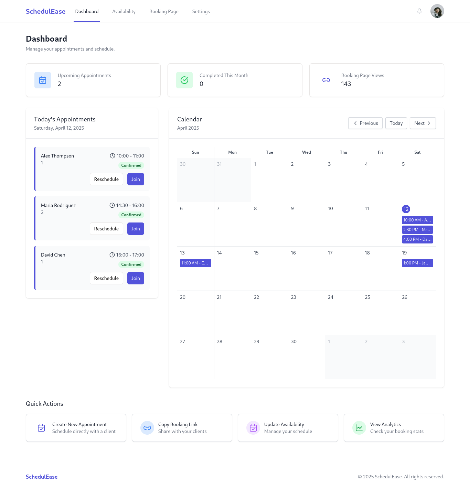

# ScheduleEase

**ScheduleEase** is a smart scheduling and appointment booking platform designed for freelancers, coaches, and small businesses. It allows users to create customizable public booking pages, define availability, and manage appointments with ease. The platform aims to simplify the scheduling process for both service providers and their clients.

## 🚀 Getting Started

### 1. Clone the repository

```bash
git clone https://github.com/mohayu22/ScheduleEase.git
cd ScheduleEase
```

### 2. Install dependencies

```bash
npm install
```

### 3. Start the development server

```bash
npm run dev
```

The app will be running at [http://localhost:5000](http://localhost:5000)

## 📷 Screenshot



